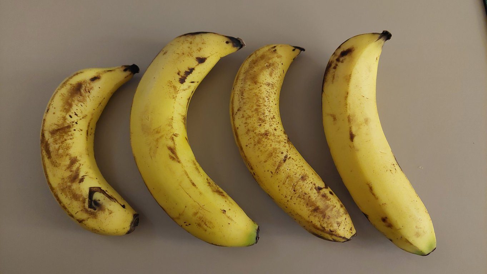
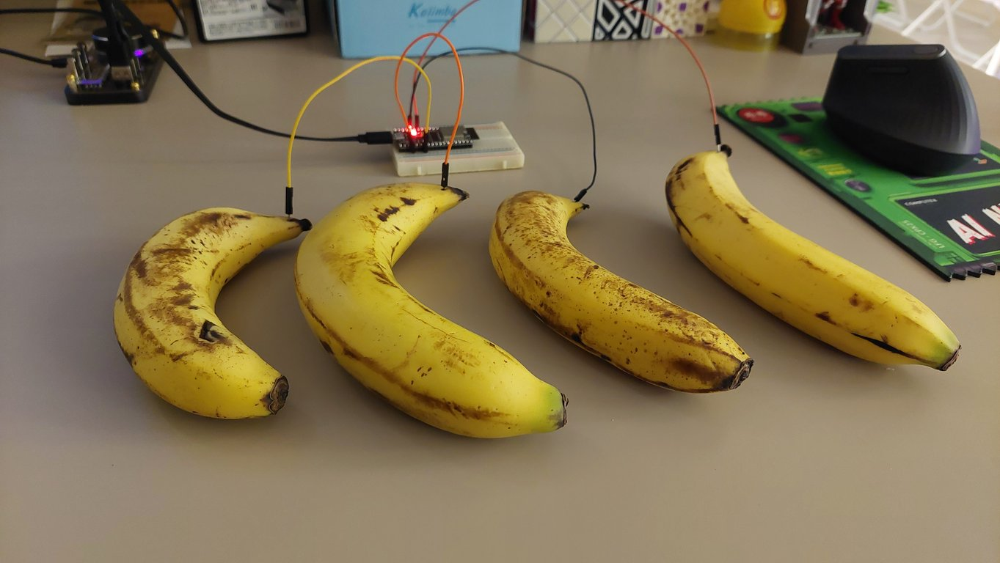
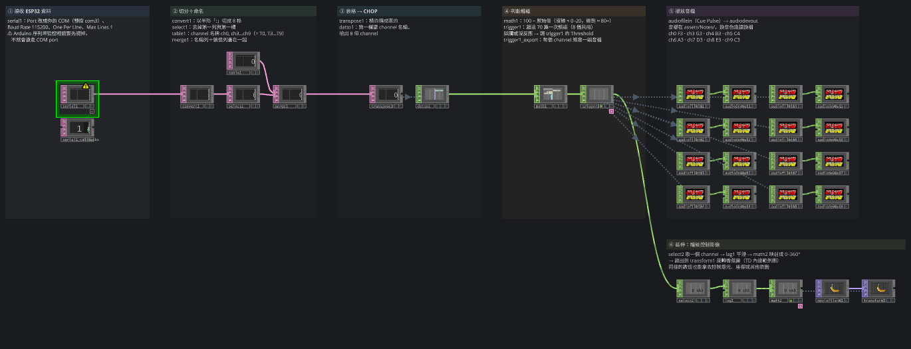
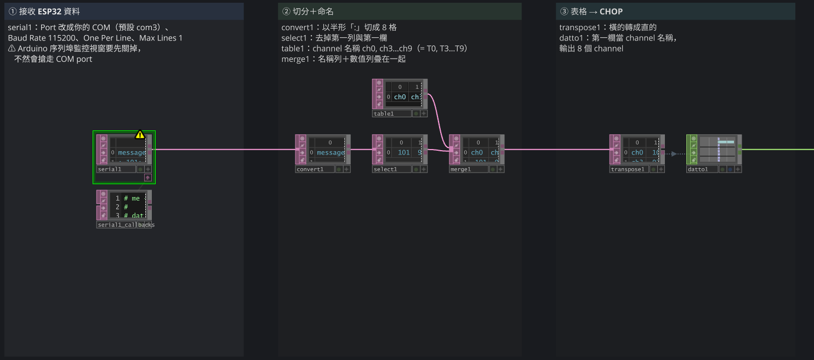
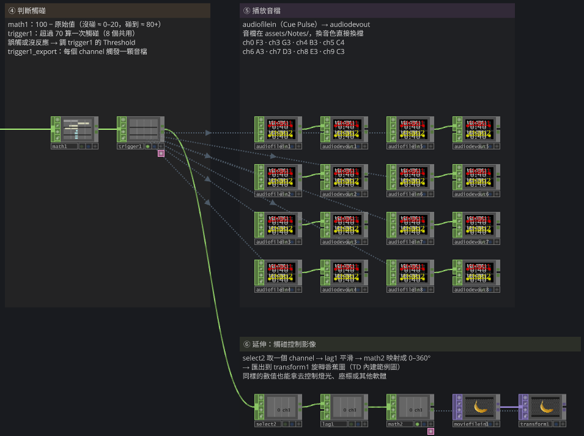

# BananaTouch — ESP32 × TouchDesigner 水果觸控音樂裝置

用一片約 NT$200 的 ESP32 開發板，把香蕉、水果、金屬片等導電物變成觸控感應點，
再由 TouchDesigner 接收數值、判斷觸碰並播放音檔。不用額外的感測模組，也不需要寫複雜的程式。

> Turn bananas (or anything conductive) into touch keys with an ESP32's built-in capacitive pins,
> stream the readings over serial to TouchDesigner, and trigger a note per touch.
> Full step-by-step tutorial (Traditional Chinese): see the blog link below.

📖 **完整圖文教學**：[用 ESP32 做水果感測音樂裝置｜電容觸控 + TouchDesigner 互動裝置入門教學](https://institute.luxmin.art/esp32-fruit-piano-with-touchdesigner/)
（材料挑選、Arduino IDE 與驅動安裝、每一步的 TD 截圖都在網誌裡，這份 README 只放上手需要的部分。）

<p>
  
  
</p>

## 檔案

```
├─ ESP_Music_Touch/ESP_Music_Touch.ino   ESP32 程式：讀 8 個觸控腳位，每 50 ms 從序列埠送出一行
├─ ESP Music Touch.toe                   TouchDesigner 專案：接收 → 判斷觸碰 → 播放音檔
├─ assets/Notes/*.wav                    8 個音（C3–C4），.toe 以相對路徑讀取
└─ docs/                                 README 用圖
```

## 需要準備

- ESP32 開發板（教學用 **NodeMCU-32S**）＋ USB 傳輸線
- 杜邦線、小麵包板（可省略）、想拿來觸發的導電物（水果、蔬菜、鋁箔、金屬片、水…）
- [Arduino IDE](https://www.arduino.cc/en/software/)，並在「其他開發板管理員網址」加入
  `https://espressif.github.io/arduino-esp32/package_esp32_index.json`，開發板管理員安裝 **esp32 by Espressif**
- TouchDesigner 2025.32050 以上（免費的 Non-Commercial 版即可）
- 若電腦抓不到 COM port，依板子的 USB 晶片安裝驅動：[CH340](http://www.wch.cn/download/CH341SER_EXE.html)／[CP210x](https://www.silabs.com/developer-tools/usb-to-uart-bridge-vcp-drivers?tab=downloads)

## 快速開始

1. **燒錄**：用 Arduino IDE 開 `ESP_Music_Touch/ESP_Music_Touch.ino`，開發板選 **Node32s**、選對 COM port，上傳。
2. **接線**：把杜邦線一端插在下表的 GPIO，另一端接到水果（直接插進去即可，用膠帶固定更穩）。不用 8 個都接。
3. **關掉 Arduino IDE 的序列埠監控視窗**（它會佔住 COM port，TD 就收不到）。
4. **開啟** `ESP Music Touch.toe`，點 `serial1`，把 **Port** 改成你的 COM（檔案預設 `com3`）。
5. 摸摸看香蕉 🍌

> ⚠️ 上傳程式、Arduino 序列埠監控視窗、TD 的 Serial DAT 三者不能同時佔用 COM port。
> 上傳失敗時，先把 `serial1` 的 **Active** 關掉再上傳。

## 接線與音高對照

| ESP32 GPIO | Touch Pin | TD channel | 觸發節點 | 音 |
| --- | --- | --- | --- | --- |
| 4  | T0 | ch0 | audiofilein1 | F3 |
| 15 | T3 | ch3 | audiofilein2 | G3 |
| 13 | T4 | ch4 | audiofilein3 | B3 |
| 12 | T5 | ch5 | audiofilein4 | C4 |
| 14 | T6 | ch6 | audiofilein5 | A3 |
| 27 | T7 | ch7 | audiofilein6 | D3 |
| 33 | T8 | ch8 | audiofilein7 | E3 |
| 32 | T9 | ch9 | audiofilein8 | C3 |

ESP32 有 10 個觸控腳位，T1（GPIO0）、T2（GPIO2）會影響開機，所以只用其餘 8 個。
想換音色，直接替換 `assets/Notes/` 裡的檔案，或改各個 `audiofilein` 的 File 參數。

## 資料怎麼流

ESP32 每 50 ms 送出一行，例如：

```
:101:92:106:109:113:121:119:118
```

每個數字是一個腳位的 `touchRead()` 值。沒碰時大約 80–110，手碰到導電物時掉到 0–20。

TD 專案裡每個步驟都有註解框，打開就看得到：



| 區塊 | 節點 | 做什麼 |
| --- | --- | --- |
| ① 接收 ESP32 資料 | `serial1` | 115200 baud、One Per Line、Maximum Lines 1 |
| ② 切分＋命名 | `convert1` `select1` `table1` `merge1` | 以 `:` 切成 8 格，去掉多餘的第一列／第一欄，接上 channel 名稱 |
| ③ 表格 → CHOP | `transpose1` `datto1` | 轉置後用 DAT to CHOP 變成 8 個 channel |
| ④ 判斷觸碰 | `math1` `trigger1` | `100 − 原始值`（碰到時會衝上 80 以上），超過 70 算一次觸碰 |
| ⑤ 播放音檔 | `audiofilein1–8` `audiodevout1–8` | trigger 透過 export 觸發各自的 Cue Pulse |
| ⑥ 延伸：觸碰控制影像 | `select2` `lag1` `math2` `transform1` | 示範把同樣的數值拿去旋轉圖片（TD 內建的香蕉範例圖） |

<p>
  
  
</p>

## 調整與疑難排解

- **誤觸或摸了沒反應**：調 `trigger1` 的 **Trigger Threshold**（預設 70）。每個 Touch Pin 的靈敏度不同，
  接上不同物體後初始值也會改變；8 個 channel 目前共用一個 trigger，需要個別調整時可以多接幾個 trigger 分開設。
- **TD 收不到資料**：確認 COM 與 Baud Rate（115200）正確，以及 Arduino 序列埠監控視窗已關閉。
- **分隔符號**：程式與 TD 的 `:` 一律使用半形，避免編碼問題。
- **線拉太長**：實測一般杜邦線／單芯線約 1 公尺內穩定，更長時靈敏度會下降，可加大感應面積（例如更大片的鋁箔）。
- **隱藏式感應**：鋁箔貼在木板或壓克力背面，隔著 5–10 mm 也能偵測手的接近。

## 授權

[MIT](LICENSE)。`assets/Notes/` 的音檔由作者以 Ableton Live 製作，隨本專案以同一授權釋出。

---

Made by [Luxmin Institute](https://institute.luxmin.art/) ·
TD 元件與專案檔：[Patreon](https://www.patreon.com/cw/LuxminInstitute) ·
活動動態：[Threads](https://www.threads.com/@luxmin.institute)
